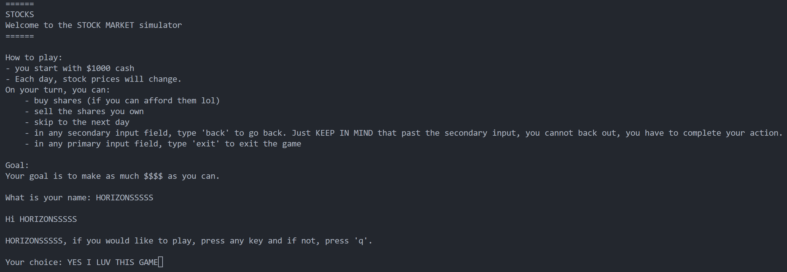
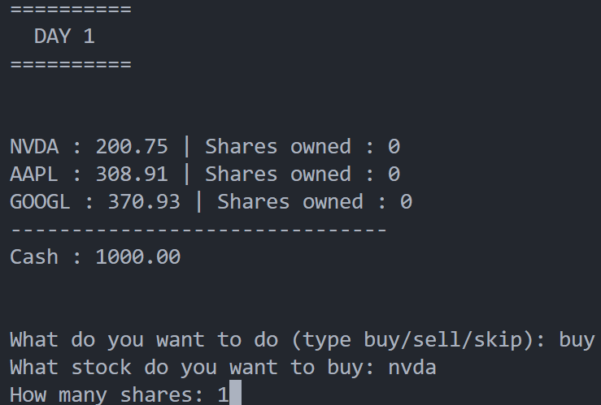
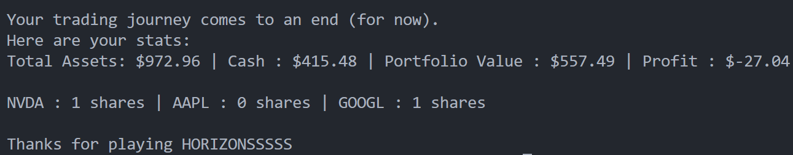

# Stock Market - Java

## About 

I wanted to make a fun terminal game that simulates the chaos of stock trading in a much more simpler way. Real trading can be pretty overwhelming, so I built a simple terminal-based app where you can manage your cash, trade real tech stocks (NVDA, AAPL, and GOOGL), and deal with unpredictable market swings. 

It was a really cool exercise in handling user input, building sub-menus in Java, and figuring out how to clear and redraw a terminal HUD dynamically so it actually feels like a game interface. 

MADE FOR **HORIZONS**

## Running

Here is a sample run for this game. On windows, running this project only requires you to download the file and run it.

This is the first section, the introduction. Just follow the instructions...

After this, you have the first day, where you can trade stocks and all that good stuff. Whenever you feel satisfied with your decisions that day, type `skip` to move onto the next day.

This is the same for all the days. 

After day 5, your trading journey comes to an end and you get to see your accomplishments (or dissapointments) during your time trading.

## What it does

## What it does

Basically, you get $1,000 to start with and 5 days to make as much profit as you can. Every day, stock prices for NVDA, AAPL, and GOOGL jump up or down randomly. You get to decide whether you want to buy shares, sell what you already own to secure your $$$, or just skip to the next day and see what the market does. 

It tracks your portfolio in real-time on a dynamic HUD, and at the end of Day 5, it tallies up all your remaining shares and cash to show your total profit or loss.

## Development

This was actually my first real project in Java. I had only been learning it for about a week before starting, so wrapping my head around how Java handles things was completely new to me.

The biggest headache was definitely controlling the console flow and managing nested `while (true)` loops. At first, my stock price generator was applying the exact same percentage change to NVDA, AAPL, and GOOGL all at once, which defeated the whole point of random stock changes!! 

Sorting out `break` vs. `continue`, fixing input validation with `Scanner` (handling non-integer inputs so the program wouldn't crash), and figuring out how to clear the HUD using took a lot of trial and error. But slowly seeing my first Java project actually take shape was pretty cool.

After learning more Java for some time, I will a 100% be coming back and improving this project for sure.

## Resources that were very helpful

- https://github.com/MissStrong/ICS4U/tree/main/Unit%202
- https://www.digitalocean.com/community/tutorials/thread-sleep-java
- https://www.baeldung.com/java-clear-console-screen
- https://stackoverflow.com/questions/67824658/how-to-handle-users-inputting-invalid-types-into-a-scanner
- https://dev.to/cal_afun_2475adb4b562023b/understanding-the-conditional-ternary-operator-in-java-4l4f

## AI

AI was used to make the summary table and stylings.